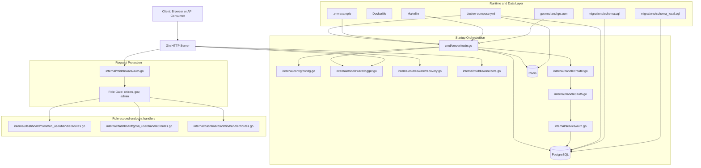

# Backend Dependency Diagram (Over2)

Date: 2026-03-15
Scope: backend folder dependency and execution map

## 1) One-page architecture view

## 2) Request pipeline

1. Incoming HTTP request reaches Gin server created in cmd/server/main.go.
2. Middleware chain executes in order: request logger, panic recovery, then CORS.
3. Router resolves path and method in internal/handler/router.go.
4. Protected groups run JWT middleware in internal/middleware/auth.go.
5. Role middleware validates required role.
6. Final role-specific handler executes and returns JSON response.

## 3) Current implemented business path

1. Fully implemented path is authentication:
   - POST /api/v1/auth/login
2. Role starter path implemented:
   - GET /api/v1/common-user/me
   - GET /api/v1/govn-user/me
   - GET /api/v1/admin/me
3. Most domain/business endpoints are planned but not implemented yet.

## 4) Runtime dependencies

1. Config and secrets: .env.example copied to .env for runtime values.
2. Database: PostgreSQL (PostGIS image in compose).
3. Cache: Redis.
4. Schema bootstrap: schema.sql is mounted as Docker init migration.
5. Build and run control: Makefile targets and go toolchain.

## 5) Practical read order for backend understanding

1. cmd/server/main.go
2. internal/config/config.go
3. internal/handler/router.go
4. internal/middleware/auth.go
5. internal/handler/auth.go
6. internal/service/auth.go
7. dashboard role route files
8. migrations/schema.sql
9. docker-compose.yml and Makefile
